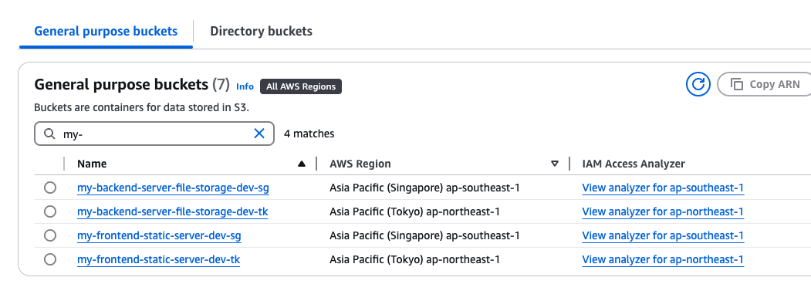

# Pre-requisite: Terraform

Before understanding more about Terragrunt, it is required to know what is terraform and how can Terragrunt solve some issues in Terraform.

Terraform, an infrastructure as code tool that lets you define both cloud and on-prem resources in human-readable configuration files that you can version, reuse, and share.

- Ref: https://developer.hashicorp.com/terraform/intro

Terraform allow us to create infrastructure or cloud resources by writing a code of resource block. Undeniably, it's a great tool when we need to create the same infrastructure across different environment. We just need to apply the same configuration or code block across different environment, and we should expect the configuration of the infrastructure to be equal across different environments.

A typical yet simplest terraform folder structure will look like the following, where each environment would have their own state file (terraform.tfstate). Resources meant to be created in that environment should be written to its respective folder.

We can run terraform in the `terraform_root/environments/dev/` folder to deploy/create resources for `dev` environment, similarly for `staging` and `prod`.

```
.
└── terraform_root/
    ├── main.tf
    ├── variables.tf
    ├── outputs.tf
    ├── versions.tf
    ├── provider.tf
    ├── README.md
    └── environments/
        ├── dev/
        │   ├── main.tf
        │   └── terraform.tfvars
        ├── staging/
        │   ├── main.tf
        │   └── terraform.tfvars
        └── prod/
            ├── main.tf
            └── terraform.tfvars
```

### Terraform Impending Problems

- Code Duplication
  - Resources created in `dev` environment needs to be copied over to `staging` and `prod` environment. Copying of resources might look alright but when your environment scales up, this become really taxing and error-prone.
  - Not a DRY (Don't Repeat Yourself) approach.
  - Very prone to Human Error
- Single state per environment can be hard to manage
  - Terraform state can easily be bloated up.
  - `Terraform plan/apply/refresh` will take longer and longer as your infrastructure scales up
- Difficult to do logical separation of projects
  - Tagging could be a hassle
- Complexity increases with Region based deployments
  - If you are using AWS, how can we tweak the folder structure to accommodate deployment to different regions (`us-east-1` & `ap-southeast-1`)?
    - The simplest way is to rename `dev` folder to `dev-us` and create another `dev-sg` folder. Next, copy the required code in `dev-us` into `dev-sg` and start running terraform in `dev-sg` to deploy resources in `ap-southeast-1` region.
      - This method is straight-forward but just not ideal...

These are the problems I faced when I was working in my organization. Terraform state becomes so huge that we start to use `-target=` arguments during `terraform plan` to speed up the deployment process.
With much faster processing speed and efficiency, everyone starts to use `-target=` as the default practice, which is a BAD PRACTICE!

> Targeting individual resources can be useful for troubleshooting errors, but should not be part of your normal workflow.

- ref: [Target resources](https://developer.hashicorp.com/terraform/tutorials/state/resource-targeting)

As time goes by, with every run becomes a target run, this results in _Infrastructure Drift_. God knows when was the last time we ran terraform apply on the entire plan, and this becomes a big problem! No engineers would take the risk to run a full sync, risking the modification or deletion of some resources that we have no idea of.

Terragrunt can absolutely solve the issues I mentioned above!

<hr>

# Terragrunt

### What is Terragrunt?

[Terragrunt](https://terragrunt.gruntwork.io/) is a thin wrapper for Terraform. It provides additional functionality and abstraction to enhance infrastructure management. It works seamlessly with terraform and even the cli commands are similar to terraform.

#### Terragrunt key features

- Code Organization; Great for Multi Region & Multi Environment
  - It has an ideal folder structure to help us handle multi-region and multi-environment deployments
  - It is easy to maintain large-scale infrastructure
- DRY (Don't Repeat Yourself) configurations
  - You do not need to copy and paste configurations from environment to environment. Writing the IaC once and set the parameters that needs to be changed across environment into variables
- Break into Smaller states
  - Instead of having 1 large state for 1 environment, we can create multiple `stacks`. Each stack be logically defined for an application needs or flow. Resources that affect the application needs/flow can be placed in its own `stack`
  - Ease of debugging. When we identify there's an issue with the application flow, we can easily pinpoint to the stack and look into it.
- Ease of managing state drift
  - we can easily run Terragrunt plan on each `stack` to ensure our small states are up-to-date. Even if there are changes, we can easily notify the team who was in-charge of the stack and resolve it.

You can fully appreciate Terragrunt after you have felt the pain using terraform in its most simplistic structure. Terragrunt as well have its drawbacks and I think the biggest drawback for now is the learning curve. I personally have not used Terragrunt for a production setup, so I couldn't comment much until I have experience it.

## My Terragrunt Setup

This Terragrunt configuration manages infrastructure across multiple AWS regions (ap-northeast-1 and ap-southeast-1) and environments (dev, uat, and prod). It's designed to support a scalable and maintainable infrastructure-as-code approach for a distributed application.

You can reference to my [Terragrunt-POC](https://github.com/Tsuweiquan/terragrunt-poc) repo to take a look.

### Requirements:

1. Multi-Region Support:
   - Infrastructure is deployed across two Asia-Pacific regions, allowing for geographical distribution and redundancy.
2. Environment Segregation:
   - Each region has separate configurations for development (dev), user acceptance testing (uat), and production (prod) environments, ensuring isolation and promoting a robust deployment pipeline.
3. Modular Stacks:
   - The infrastructure is divided into reusable stacks:
     - s3_frontend_stack: Manage S3 buckets for frontend static content hosting.
     - another_backend_stack: Presumably handles backend infrastructure components.
4. DRY Principle:
   - The use of a root terragrunt.hcl file and stack-specific configurations promotes code reuse and reduces repetition.
5. Flexible Deployment:
   - This structure allows for easy deployment of specific stacks in particular environments and regions, facilitating targeted updates and rollouts.
6. Stack Dependency:
   - The stacks should be configured in a way that a dependency link can be formed.
7. Global Variables:
   - Global variables can be inferred by folder name in the path, allowing all stacks to utilize the variables and apply to their resources.
8. Generating files automatically via Terragrunt

### Folder Tree

```
├── readme.md
├── terraform-root
│   ├── ap-northeast-1
│   │   ├── dev
│   │   │   ├── another_backend_stack
│   │   │   │   └── terragrunt.hcl
│   │   │   └── s3_frontend_stack
│   │   │       └── terragrunt.hcl
│   │   ├── prod
│   │   │   └── terragrunt.hcl
│   │   └── uat
│   │       └── terragrunt.hcl
│   ├── ap-southeast-1
│   │   ├── dev
│   │   │   ├── another_backend_stack
│   │   │   │   └── terragrunt.hcl
│   │   │   └── s3_frontend_stack
│   │   │       └── terragrunt.hcl
│   │   ├── prod
│   │   │   └── terragrunt.hcl
│   │   └── uat
│   │       └── terragrunt.hcl
│   └── stacks
│       ├── another_backend_stack
│       │   ├── main.tf
│       │   ├── terragrunt.hcl
│       │   └── variables.tf
│       └── s3_frontend_stack
│           ├── main.tf
│           ├── terragrunt.hcl
│           └── variables.tf
└── terragrunt.hcl
```

### Stacks

I have created 2 sample stacks, `s3_frontend_stack` and `another_backend_stack` in the `/terraform-root/stacks/` directory. In this folder, the DRY terraform code should be written here.

In `/terraform-root/stacks/s3_frontend_stack/main.tf`, I have inferred a module from `terraform-aws-modules/s3-bucket/aws` to create a S3 bucket for me in AWS. Take note that terraform code below is DRY. Anything that should be changed for different environment or region should be pointed to a variable. Any other configuration that you want it to be fixed across env can be hard-coded.

```
module "s3_wq_static_server_new" {
  source  = "terraform-aws-modules/s3-bucket/aws"
  version = "4.3.0"
  bucket  = "my-frontend-static-server-${var.env}-${var.region-suffix}"
  acl     = "private"

  control_object_ownership = true
  object_ownership         = "ObjectWriter"

  versioning = {
    enabled = true
  }
}
```

In `/terraform-root/stacks/s3_frontend_stack/variables.tf`, I have declared the variables that are used in the `main.tf` file. In this particular case, I only need to declare 2 variables.

Take note that I have set the variables to `null`. Setting the default value here to `null` is an indication that this variable here is for declarative purposes only and this default value should not be used. It's my personal preference to do this as these variables should be inferred from another folder in terragrunt.
Furthermore, setting the variable value to null will cause terragrunt to encounter an error if no variable was set in the right place. I prefer to hit an error during `terragrunt plan`, rather than setting the wrong default value.

```
variable "env" {
  default = null
}

variable "region-suffix" {
  default = null
}
```

In `/terraform-root/stacks/s3_frontend_stack/terragrunt.hcl`, it's as simple as it gets. This file is used to direct terragrunt on where to look for the root `terragrunt.hcl`.

```
include "root" {
  path = find_in_parent_folders()
}
```

### Multi Region and Multi Environment

Firstly, I have created 2 folders under `terraform_root/`, with AWS region name.

- `terraform_root/ap-southeast-1`
- `terraform_root/ap-northeast-1`

Under the region folder, I declared the environment folders

- ap-southeast-1
  - `terraform_root/ap-southeast-1/dev`
  - `terraform_root/ap-southeast-1/uat`
  - `terraform_root/ap-southeast-1/prod`
- ap-northeast-1
  - `terraform_root/ap-northeast-1/dev`
  - `terraform_root/ap-northeast-1/uat`
  - `terraform_root/ap-northeast-1/prod`

Under each environment folder, this is the place we should set the value for our variables for each of our stack.

Looking into `terraform_root/ap-southeast-1/dev/s3_frontend_stack/terragrunt.hcl`. We can easily set variables value specifically for `s3_frontend_stack` variables. In this case, we can actually set the value for `var.env` and `var.region-suffix` here,

However, I did not do it because this variable value is required to set in all other stack, and potentially we will be repeating the same value to be set. This does not follow DRY approach, so I will be setting this variable in another file.

```
include "root" {
  path = find_in_parent_folders()
}

terraform {
  source = "../../../stacks/s3_frontend_stack"
}

inputs = {
  # Environment-specific variables for s3_frontend_stack stack
  # env = "dev"            # can set here but not wise to do so, it's not DRY
  # region-suffix = "sg"   # can set here but not wise to do so, it's not DRY
}
```

### Global Variables

The global variables can be declared in `/terragrunt.hcl`. The root `terragrunt.hcl` file is a configuration file that defines settings for a Terraform project's infrastructure. This is also the file that declares the backend to store the remote state. In this file, we can also declare global variables which I do so based on folder path.

terragrunt.hcl

```
locals {
  path_components = split("/", path_relative_to_include())
  region = local.path_components[1]
  env = local.path_components[2]
}

# Global Variables across region and environment
inputs = {
  region = local.region
  env = local.env
  region-suffix = local.region == "ap-southeast-1" ? "sg" : local.region == "ap-northeast-1" ? "tk" : ""
}
```

Using locals, I used a split function with the `path_relative_to_include()` to extract the value for env and region. My fixed folder structure can easily help us to set the `var.env` and `var.region-suffix` when we run terragunt in the stack.

Example: if we run terragrunt on the `s3_frontend_stack` stack in `dev` environment, the `terraform_root/ap-southeast-1/dev/s3_frontend_stack/` path will be referenced.

From this path, terragrunt can set

- var.region -> "ap-southeast-1"
- var.env -> "dev"
- var.region-suffix -> "sg"

terragrunt on the `s3_frontend_stack` stack in `dev` environment will apply the above value to it's stack. This method is very good to do resource tagging!

### Generating files

Terragrunt offers a feature to generate files that are duplicated in every stack.  
The `generate` blocks in Terragrunt allow you to:

1. Automatically create consistent configuration files across multiple stacks
2. Reduce repetition in your Terraform configurations
3. Ensure uniformity in backend and provider setups

People often use this to generate the `backend.tf` and `provider.tf` across the stacks.

The following below is an example to create a `terraform.tfstate` for each stack and a provider for each stack, based on the region that is referred by the folder path.

> Note: Below is configured to store the state in a fix s3 bucket `207756197509-terragrunt-state`. You should be able to variablize this as well, if your prod and non-production AWS account is different with a different s3 bucket name.

```
remote_state {
  backend = "s3"
  generate = {
    path      = "backend.tf"
    if_exists = "overwrite_terragrunt"
  }
  config = {
    bucket = "207756197509-terragrunt-state"
    key    = "${path_relative_to_include()}/terraform.tfstate"
    region = "ap-southeast-1"
    encrypt = true
    dynamodb_table = "207756197509-terragrunt-state-locking"
  }
}

generate "provider" {
  path      = "provider.tf"
  if_exists = "overwrite_terragrunt"
  contents  = <<EOF
provider "aws" {
  region = "${local.region}"
}
EOF
}
```

Expected output:

- each stack in each region in each environment have a stack of its own.
- running terragrunt in the `ap-northeast-1` will deploy resources to `ap-northeast-1` due to the `provider.tf` file being generated with the region set to `ap-northeast-1`

another_backend_stack

- s3://207756197509-terragrunt-state/terraform-root/ap-southeast-1/dev/another_backend_module/terraform.tfstate

s3_frontend_stack

- s3://207756197509-terragrunt-state/terraform-root/ap-southeast-1/dev/s3_frontend_module/terraform.tfstate

### Statefile are stored in S3 with such prefix /REGION/ENVIRONMENT/STACK_NAME


States are in S3 bucket, in REGION folder and in ENVIRONMENT folder.

# How to run

```
# Ensure you have AWS Access & Secret Key in your pc before running
# Run aws configure to setup the key
aws configure

# Verify if you are accessible via aws cli
aws sts get-caller-identity --no-cli-pager

# This will deploy/create all the stacks in DEV environment
# - Stack ./dev/another_backend_stack
# - Stack ./dev/s3_frontend_stack
cd terraform-root/ap-northeast-1/dev
terragrunt run-all init
terragrunt run-all plan
terragrunt run-all apply

# To deploy a single stack
cd terraform-root/ap-northeast-1/dev/another_backend_stack
terragrunt init
terragrunt plan
terragrunt apply
```

# Resources created via Terragrunt


