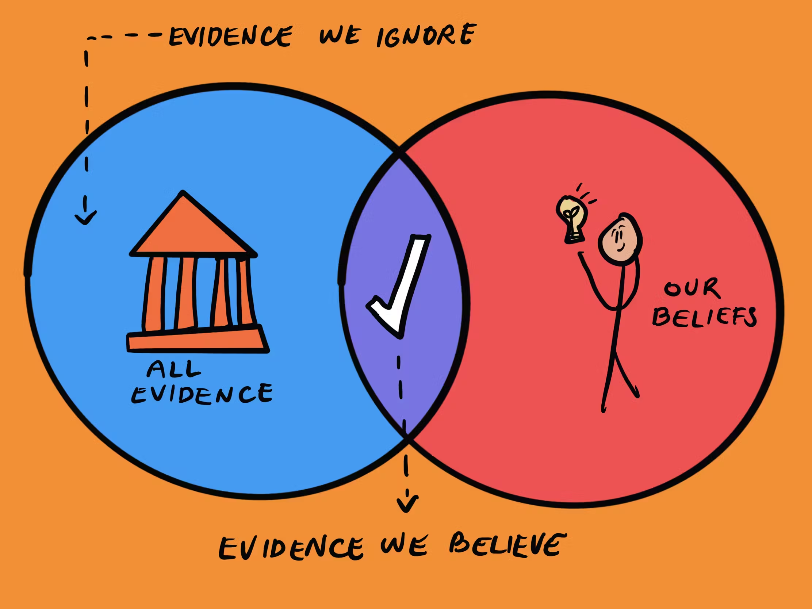

### ⚡ New workplace, new start?

I have joined a Energy Company in mid 2025 and this is the start of my 2nd Job. The company is in the Energy Industry which is a different from my first job.
I was intrigued to join this company as I wanted to explore a different industry and see how the culture and mindset differ from my previous workplace.
I was also curious about the technologies used in the energy industry and wanted to see how different or similar it is compared to the finance industry.
My role here is a Senior Platform Engineer, working closely with the DevOps team to provide a stable and secure platform for the development teams to build and deploy their applications.

   

### 🌅 Initial Expectations

#### Decision Documents

I have never written a Decision Document before nor understand the importance of a Decision Document.
In my previous organization, there was never a need of a decision document or rather there was no requirement that a decision document requested by my superiors before deciding on a choice.
It was always a quick decision made by the lead or manager and the team just follow through. When I had questions, I would ask the lead directly and get my answers. The lead was convincing enough for me to stop questioning and give my support for change.

In this workplace, most changes require a Decision Document. As I try to understand why is there a need of a Decision Document, I eventually got convinced by the benefits of it and think that this practice should also be implemented in my previous organization
I will list down some positive and negative of having a Decision Document in my opinion.

Positives:

1. A detailed documentation of existing problem that require huge technological changes in the organization.
   - With a detailed documentation of existing problem and a decision on the solution to use this method, new engineers can always look back into the documentation to understand what was the problem back then and why the current solution was implemented. The current solution on first look might be complicated/non-elegant/unconventional, however it was designed in this way due to business requirements that require this specific solution.
2. Ownership & Traceability
   - Whoever or whichever team created the decision document should own the problem, provide multiple suggested solutions and open to the tech team for review. The creators should welcome feedback/concerns by different engineers and eventually come to a decision of the proposed solution.
   - After the decision is made of a certain solution, stakeholders should be responsible for the solution and continue to support it during the implementation phase till maintenance phase.
   - With the completed decision document, the implementors will take ownership of the solution as a product as it goes live and whoever paved the way to success will be credited.
3. Knowledge & Experience Sharing
   - Decision Documents can be brutal. Whoever raised the decision document will be heavily critique by the Leads/Staff/Senior Engineers from any and every team. The comments might even be so harsh to a certain extent where the creator of the document might feel regretful of creating the document (I have been in this position before 😅).
     Take it in positively, experience engineers are asking the brutal questions to make you think of scenarios that you could have never imagined. They might have experienced it before, went through with this proposed solution and seen other problems ahead, hence the brutal question. Those brutal questions could even be a retrospective point that something in your solution is lacking. It will drive you to continue doing more research and PoC of other alternative solutions which could be better or easier to implement. All these brutal comments are to grow you!
   - It's just professional work. Why would another engineer want to attack you for no reason. We all just want the system/workflow to be in a stable state, so we don't have to wake up in the wee hours to fix problems.
4. Refute before Implementation
   - Decision Document is a way to let everyone know the plan before implementation.
   - There should always be a review of the decision document by the relevant stakeholders but not limited to them only.
   - Anyone and everyone should be allowed to review them, even the Product or Project Managers.
   - With that, if anyone has any problems with the decision document or the proposed solution, they should voice out immediately.
   - Anyone who doesn't comment or voice out, will implicitly mean that they are ok with the proposed solution.
   - This is a chance to refute and reject the plan before implementation and integration. Implementation, Integration and Migration takes a long time and hours of many engineers time, which in tune means money.
   - Being allowed to refute early, saves the company expenses instead of cancelling the project midway.
   - Whoever didn't voice out their concerns during the review phase, should not have any authority to cancel the project midway as they have implicitly agreed to the plan.

Negatives:

1. Time Consuming
   - Writing a detailed decision document takes time. Researching on multiple solutions, pros and cons, cost analysis, implementation plan, migration plan, rollback plan, testing plan etc takes a lot of planning and time.
   - Reviewing a decision document also takes time. From what i have experienced, we had to leave the document open for at least 2 weeks for everyone to review it.
   - Not everyone cares to read through the entire document. Some might just skim through it and give their comments without fully understanding the problem or the proposed solution.
2. Over Engineering
   - Sometimes, the proposed solution might be over engineered for the problem at hand.
   - The team might end up spending more time and resources on implementing a solution that is too complex for the problem. Occasionally, the team will think of a scalable solution that is not required at the moment.
   - The team might miss out on simpler and more efficient solutions that could quickly solve the problem for business needs.
3. Decision Paralysis
   - With too many stakeholders involved in the review process, it might lead to decision paralysis.
   - Everyone has their own opinions and preferences, which might lead to endless debates and discussions without reaching a consensus.
   - This might delay the implementation of the solution and affect the overall project timeline.
   - Ultimately, the team might end up sticking to the status quo or when a solution is forced upon them by higher management, the engineers who disagree with the decision might not be fully committed to the implementation and maintenance of the solution.

#### An Engineer in someone else's house

Joining a new company is like being an engineer in someone else's house. You have to respect the existing setup and culture, even if you don't agree with it.
You have to understand the reasons behind the existing setup and culture, and adapt to it.

I reflected on this statement a lot during my initial months in this new company.
This was something that I did not adhere to in my first few months in this new company and I am now struggling to manage my reputation.
I was too eager to change things that I thought were wrong or insecure, without fully understanding the context and constraints of the existing setup. Furthermore, things that was proposed to be changed by the team was approved with a decision document by the stakeholders.
Initiating another change without understanding the full picture was seen as disruptive and disrespectful to the existing team and their work.
This led to friction with my colleagues and superiors, as I was seen as someone who was trying to change without much business value and dismissing their work.

This has taught me a valuable lesson in humility and patience.
I have to take a step back to learn to work within the existing framework and culture, and gradually introduce changes that are aligned with the business needs and goals.
My mindset was wrong where I thought that during my probational period, I should be making impactful changes to prove my worth to the company. I was deep into the mindset of "fixing" things that I thought were wrong in my perspective.
Furthermore, what's wrong to me from my previous experience might not be wrong in this new context. It was acceptable to them as it met their business needs and constraints.
Instead, I should have been focusing on understanding the existing setup, culture and constraints, and building relationships with my colleagues and superiors.
Only after gaining their trust, respect and understanding of the business needs, then I can propose changes that are aligned with the business goals and have their support.

I now hold this phrase dearly to my professional life: "Don’t grow a company with just the knowledge you have — let the company grow you by expanding your knowledge."

### 🧗‍♂️ What I could have done better

1. I should have used my probation time to focus on analyzing the existing infrastructure setup and question _WHY_ it was done like this. Understand it from a technical perspective to the business needs. Document the reason down and best to always have a diagram drawn for any business flows.

   - Constantly question why things are implemented that way (Very important!)
   - Need to also understand the limitations that influence this design/implementation.
   - Talk to existing employees to understand if the implementation has any other pain points.
   - After understanding _WHY_, create a concrete plan to suggest change, addressing the pain points while considering the limitations.
   - Write / Record / Document down every point that the existing employees share. The reason why they mentioned it because it's important to them and that's something I need to take note of.
   - For any work on existing setup, build an understanding of the whole system/pipeline before execution, it's always important to understand the potential impact of the change.
   - Don't have to implement change alone, can always work together with the team to study or improve existing setup.

2. I should have practiced Critical Analysis without any influence from teammates. This was mentioned in a casual conversation that resonate with me. I look up to senior and more experienced engineers for their knowledge and experience. However, I tend to be influenced by their opinions and perspectives, which might not always be the best for the situation.

   - I should constantly remind myself to be critical of any information or opinions that I receive, and evaluate them based on their merits and relevance to the situation. This will help me to develop my own perspective and understanding of the situation, and make better decisions based on my own analysis. This is part of my growth as an engineer and character development.
     - Honestly, I did not notice this behavior that I unknowingly adopted until it was mentioned to me by a colleague. I wish I had noticed it earlier and worked on it sooner.
   - Manage Bias and stray away from Confirmation Bias.
     - What I know and experience is what I am biased towards. Naturally, I will tend to favor solution or opinions that align with my existing knowledge and experience. With Bias, I might overlook or dismiss alternative solutions or perspectives that could be better suited for the situation.
     - I should keep an open mind and actively seek out diverse perspectives and solutions, even if they challenge my existing beliefs or knowledge. Try new technologies and solutions that I have never used before. Understand the pros and cons of each solution and evaluate them based on their merits and relevance to the situation. Document them in my own knowledge base for future reference and grow my knowledge. The solution that I am biased towards might not always be the best for the current situation but could be the best for another situation in the future.

   

      
   

   Today, I feel that his formula is very apt for my current situation:

   > Critical Analysis + Managing Bias -> Better Decision Making -> Better Engineer -> Better Person

### 💪 What I feel I did right!

1. I took time to analyze the network flow that was designed and deployed by another engineer. I trace the setup from source to destination, draw the architecture diagram, understand why it was designed in that day and present it to other colleagues to verify the flow.

   - I have asked why it was implemented that way.
   - I saw the decision document that was created for the implementation and understood the business needs that drove the design.
   - I talked to the developers who required this setup for business needs.
   - From this exercise, I see multiple benefits for myself and the team
     - I have gained a deeper understanding of the network design and the business needs that drove it. Now, not only 1 engineers understand the flow, but multiple engineers do.
     - This knowledge sharing will help the team to troubleshoot any issues that might arise in the future
     - I even managed to point out some redundant infrastructure that could be removed to save cost.
     - I also documented the entire flow and created a diagram for future reference.
       - Easy for anyone to adopt and trace the flow in the future.
     - This exercise has also shown the point of failures in the design, which could be improved in the future.

2. Studied the CI/CD setup in Github Actions and understand the terraform structure

   - I was new to Github Actions, so this was a good opportunity for me to learn and understand the tool. This allowed me to understand the difference between Github Actions and Gitlab CI/CD.
   - I took some time to understand the existing CI/CD setup in Github Actions, including the various workflows and how they interact with the codebase.
   - I familiarized myself with the terraform structure used for infrastructure as code, including the modules and resources defined.
   - I understood the deployment process and how the CI/CD pipeline integrates with the infrastructure setup, and the deployment process for applications.
   - With the knowledge gained, I was able to write new pipelines and create automation for certain tasks.

3. Request for knowledge transfer

   - Always request for knowledge transfer from more experienced engineers.
   - This will help to understand the existing setup and design decisions better.
   - It will also help to build relationships with colleagues and superiors.- Lastly, this will help to grow my knowledge and skills as an engineer and help developers with their needs and requests.

4. Helping developers with their needs and requests
   - I feel that this is the most important part of my role as a Platform Engineer or even as an DevOps Engineer. My principle is to always help developers with their needs and requests, as they are the ones who will be using the platform and infrastructure that I am building and maintaining.
   - My role is to make developers' lives easier by providing them with a stable, secure and efficient platform to build and deploy their applications.
   - By helping developers with their needs and requests, I am also understanding what their applications require and how I can improve the platform to better serve them.
   - At times, they might ask for features or changes that our current infrastructure does not support. This is an opportunity to discover and implement new technologies or solutions that can benefit the developers and the company as a whole.
   - By being responsive and attentive to developers' needs, I am building trust and rapport with them, which is essential for a successful collaboration.
   - Looking in a big picture, by helping developers, I am also contributing to the success of the company as a whole, as developers are the ones who will be building the products and services that the company offers to its customers. With that, I feel a sense of fulfillment and of course be looking forward to company growth and monetary benefits (bonuses!) as the company does well.
